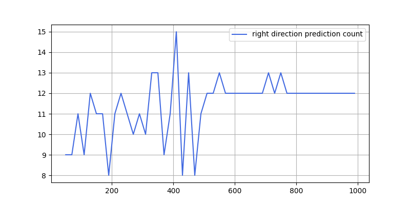
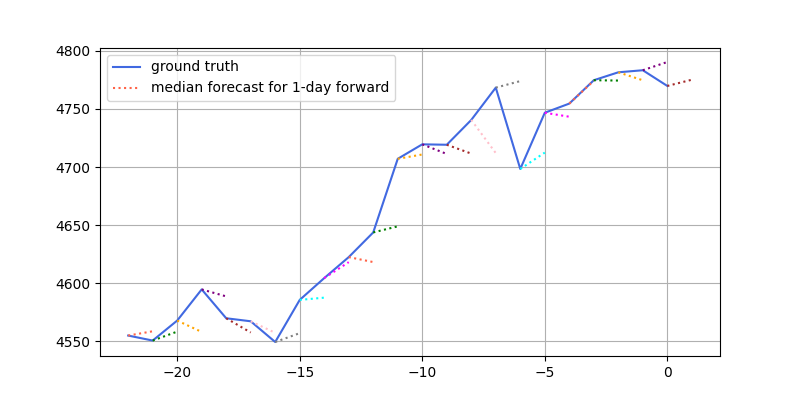
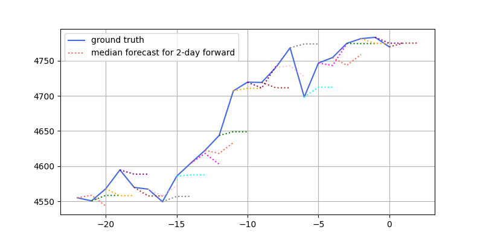
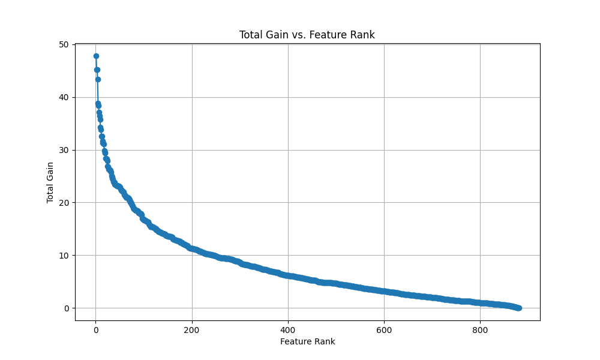
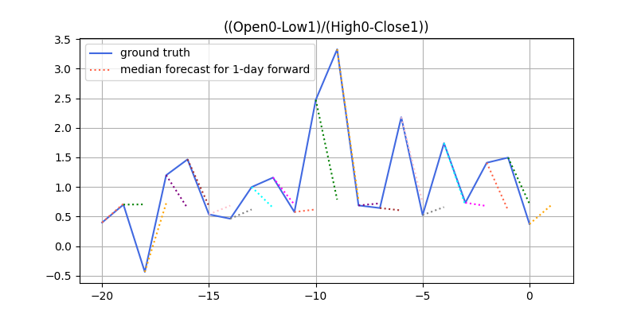

# Assignment 3

## 0. Introduction

This assignment focuses on leveraging LLMs for SPX index's `Close` price time series forecasting. We use two approahces and introduce them in two sections separately:

1. **Zero-shot LLM: We directly try forecasting with LLM in a zero-shot fashion**
   - The LLM is applied directly to predict unseen SPX data without prior training on such stock prices.
   - We input the sequence of historical `Close` prices and output the forecasted `Close` price.

2. **LLM + LSTM: Feature Engineering with LLM and Forecasting with LSTM**
   - First, generate and select the top 100 features derived from historical `OHLC` prices.
   - Then, using historical data, train an LSTM model with these features to predict the directional movement of the historical `Close` price.
   - Finally: utilize the LLM to forecast the top 100 features for the upcoming days and apply the trained LSTM model to predict the directional movement of the `Close` price for those future days.

## 1. Zero-shot LLM (`chronos_various_test.py` and `chronos_main.py`)

#### 1) The right model 

After reviewing various SOTA LLMs, we found the latest [Chronos](https://github.com/amazon-science/chronos-forecasting), a pretrained time series forecasting model, generates the most remarkable zero-shot performance. We therefore use Chronos as the backbone for all tasks below, where for each prediction we generate 100 samples and use the median as the output. 

#### 2) The right rolling look-back window

Determining the optimal number of past prices for future price forecasting is crucial. We tested the size of rolling look-back windows from 10 to 1000, e.g., using a 300-day window means each prediction is based on the previous 300 prices. 

We test the prediction of the next-day `Close` price for the final 10, 20, 30, 40, and 50 days in the given `SPX.csv`.

Our analysis revealed that a 400-day look-back window consistently yielded the highest accuracy across all test days. The plot below illustrates this with the final 20 days, where correct predictions peak (15) at a window size of 400.

Other plots can be found at `./look_back_window`. In the following tasks, we stick to look-back window with size 400.

#### 3) The right forward window 

Determining the optimal number of future prices to forecast based on a fixed number of past prices is equally important. Our analysis showed that predicting just one day ahead provides the most proper results, while longer forecasts tend to deviate significantly from the actual values.

Below are the comparable examples of one-day (top) and two-day (bottom) forward predictions:

Other forward windows can be found at `./look_forward_window`.

Nevertheless, we can still do multi-day forecasts using a step-by-step approach: first, predict the next day, then use that prediction as the basis for the following day, rolling the look-back window forward for each subsequent day.

#### 4) The results for next four days

Using a fixed look-back window of `400` and a forward window of `1`, we input the `Close` price movement into the Chronos LLM and obtained predictions for the next four days.

The actual `Close` prices on the last given day along with the predicted prices for the next four days are 4769.83, 4772.49, 4774.26, 4776.10, and 4778.05, resulting in the next four-day `Close` price movements as: `up`, `up`, `up`, and `up`.

## 2. LLM + LSTM (`feature.py` and `predict.py`)

#### 1) Features from `OHLC`

Inspired by a 2021 PhD [thesis](https://discovery.ucl.ac.uk/id/eprint/10155501/2/AndrewDMannPhDFinal.pdf), we mine features from `OHLC` using all possible combinations of differences, ratios, and pairwise operations of daily `OHLC` data with L lags. Specifically:
   - Lags (L): Refers to the number of days considered, e.g., L=2 includes today (0) and yesterday (1).
   - Differences: Calculations of differences between `OHLC` values at various lags, e.g., `Close0 - Low1`.
   - Ratios: Ratios of `OHLC` values at different lags, e.g., `Low0 / Low1`.
   - Pairwise Operations: Operations (both differences and ratios) between features derived from Differences and Ratios, e.g., `(Close0 - Low1) / (Low0 / Low1)`.

#### 2) Rank and select the top 100 features
We set L=2 and generated over 800 features. XGBoost is then employed to rank each feature's importance with respect to predicting the next-day `Close` price directional change, using the total gain metric.

The importance curve is illustrated below:

We selected the top 100 features, and their names are listed in `./lstm/top100.txt.`

#### 3) Build LSTM model

With 100 features selected, we built an LSTM model to predict the directional movement of the `Close` price using historical data. Due to the limited dataset size (3720 days), we opted for a simple network structure with few layers.

We split the historical data into training and testing sets. After 20 epochs of training, the model achieved an accuracy of 56.15% on the test set. We anticipate that accuracy could improve substantially with additional data (e.g., hourly `OHLC`) in the future and more complex models (e.g., Transformers). 

In addition, even when using LSTM models, it's been noted that the `Mid` price, calculated as (`Close`+`Open`)/2, is often a better target for prediction than the Close price. [Research](https://discovery.ucl.ac.uk/id/eprint/10155501/2/AndrewDMannPhDFinal.pdf) suggests that the accuracy of predicting the `Mid` price can potentially be as high as 74.48% due to its lower standard deviation compared to the `Close` price.

#### 4) Use LLM to generate next-day features

We now have sequences of 100 features for all historical data. Each sequence can be input into the LLM to predict values for the next few days, using the same LLM backbone, look-back window, and forward window as described previously.

An example of the performance of LLM in predicting next-day feature ((Open0-Low1)/(High0-Close1)) is shown below:

#### 5) The results for next four days

Finally, using features generated from the LLM and the trained LSTM model, we predict the next four days of `Close` price movements as: `down`, `down`, `up`, and `up`.

## 3. Notes after assignment3
In this project, given the limited data and time constraints, I combined zero-shot LLM with `OHLC` factor mining. While `OHLC` factor mining is valuable for exploring interactions between `Close` and `OHL` prices, it's not the only approach. In addition, I found that zero-shot LLMs like LLMTime and Chronos are not yet reliable for stock price prediction. 

A more effective approach would be to train models ourselves.

Potential directions include:
   - Multivariate time seris model: Train a model using `OHLC` and/or other variates (say in total `N` variates) as inputs with `T` time steps and `N` variates to predict future sequence with `S` time steps and `N` variates. This approach fully explores correlations between variables, offering more specific and reliable predictions. Quite a lot [SOTA](https://github.com/ddz16/TSFpaper/tree/main?tab=readme-ov-file) works are doing in this way. If only `Close` predictions are needed, we can extract the coresponding one from `N` predicted variates.
   - Intra-stock correlation: consider models like [MASTER](https://github.com/SJTU-DMTai/MASTER), a specialized transformer for stock price forecasting that accounts for both momentary and cross-time stock correlations, enhancing feature selection with market information.

